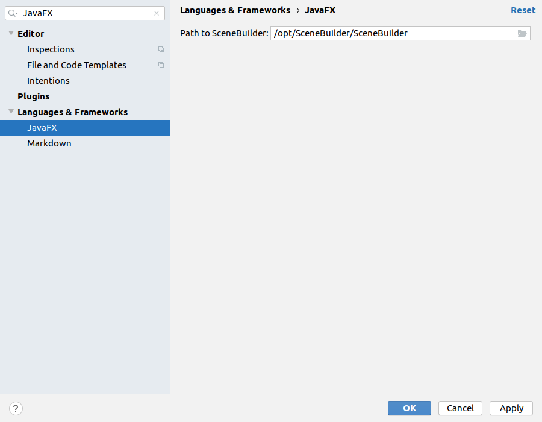
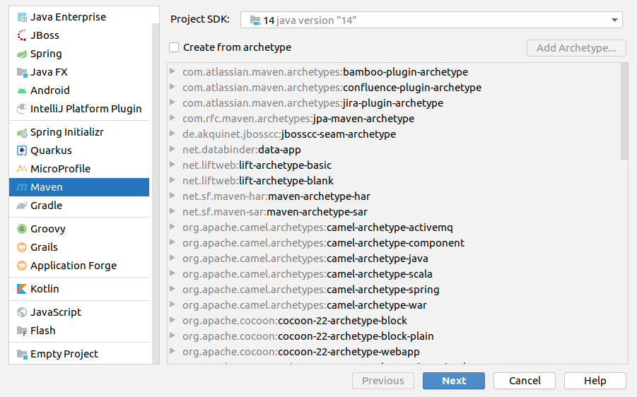
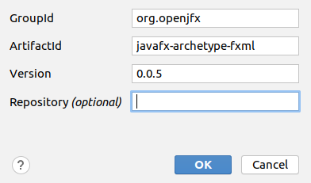
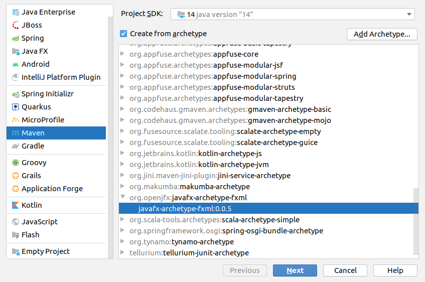
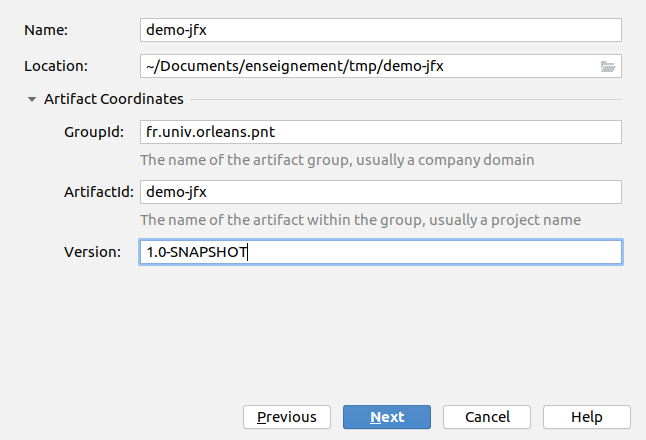
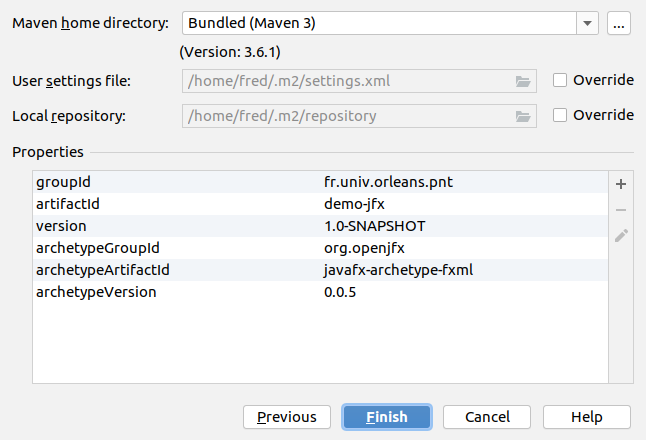

= Comment installer JavaFX ?

Tuto sur l'installation/configuration de JavaFX et SceneBuilder,
sous IntelliJ

== Téléchargements

=== Pré-requis

avoir un JDK 11 ou 14 (ou les deux) déjà installé : https://jdk.java.net/14/

=== Installations pour JavaFX

Téléchargez et installez :

* Scene Builder for Java 11 [pour votre OS] : https://gluonhq.com/products/scene-builder/

* JavaFX SDK [pour votre OS] en version 11 ou 14 : https://gluonhq.com/products/javafx/
(zip à extraire dans un chemin sans espace, eg /opt ou /libs/java)

=== Configuration d'IntelliJ

Lancez IntelliJ,

Dans le menu `File` -> `Settings`, chercher "JavaFX"

CLiquez sur `JavaFX` et dans `Path to Scene Builder`, mettez le chemin d'accès
vers l'exécutable installé de Scene Builder à l'étape précédente
(eg dans /opt/SceneBuilder/SceneBuilder sous linux)

== Création d'un projet FXML

Pour vérifier le bon fonctionnement de JFX,
nous allons créer un projet de démo fxml avec un Archetype Maven.

Dans le menu `File` -> `New` -> `Project...`, choisir comme type de projet `Maven`

Sélectionnez votre SDK (eg JDK 11 ou 14)

puis cochez `create from Archetype`

Cliquez sur "Add Archetype..."

Dans la fenêtre, saisissez le
`GroupId` : `org.openjfx`,
`ArchetypeId` : `javafx-archetype-fxml`
et `Version` : `0.0.5`

puis Cliquez sur OK.

Choisissez cet archetype dans la liste puis cliquez sur Next

Dans la fenêtre de configuration suivante, donnez un nom au projet, une Location
et en développant Artifact Coordinates, changez éventuellement les GroupId, ArtefactId ou Version de votre projet.

Cliquez sur Next

puis validez la création du projet par Finish

Maven génère un projet avec du code FXML que vous pouvez maintenant modifier/complèter.

Have fun.

NOTE: Pour se passer du module-info.java, ajoutez dans votre configuration de run
des `VM Options` : `--module-path /opt/javafx-sdk-14/lib --add-modules javafx.controls,javafx.fxml`

